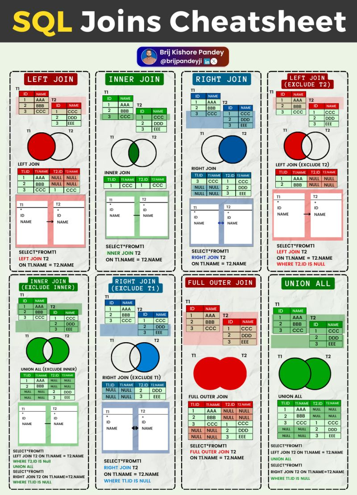
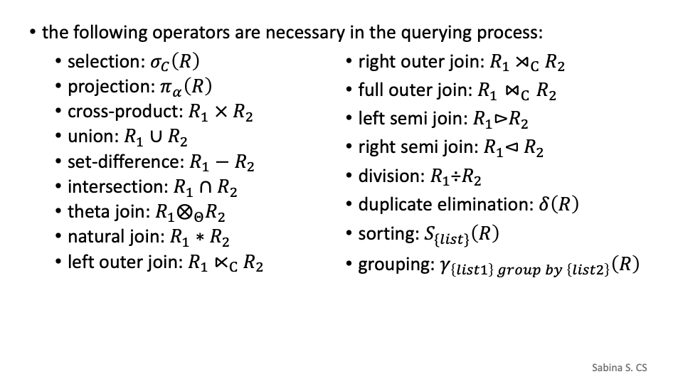
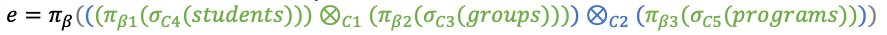
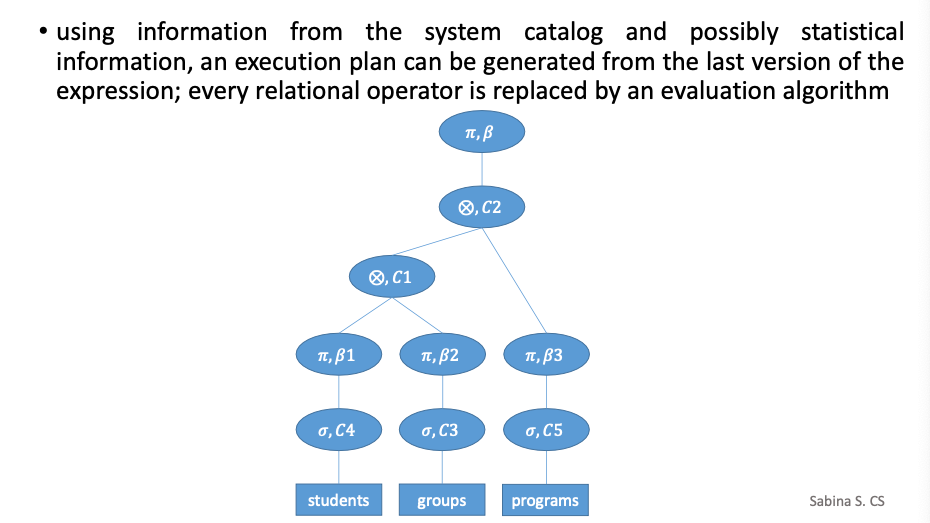

# Theory

## SQL Query Order of Execution

The general order of SQL statement execution, from first to last, is as follows:

1. **FROM**: Specifies the tables or views to be queried.
2. **JOIN**: Defines how to combine multiple tables (if applicable).
3. **WHERE**: Filters rows before any grouping or aggregation.
4. **GROUP BY**: Groups the rows based on specified columns.
5. **HAVING**: Filters groups after the GROUP BY step.
6. **SELECT**: Determines which columns to include in the result.
7. **DISTINCT**: Removes duplicate rows from the result set.
8. **ORDER BY**: Sorts the result based on specified columns.

## B-tree order and properties

A *B-tree of order* $m$ has the following properties:

1. **Internal (non-leaf) nodes:**
    - Can have at most $m$ children and $m - 1$ keys(ordered values).
    - Can have at least $\lceil m/2 \rceil$ children.
2. **Leaf nodes:**
    - Must all appear at the same level (balanced property).

## 2-3 Trees
---

## Define the key from the relational model

A key in the relational model is an attribute or a set of attributes that uniquely identifies a tuple within a relation, ensuring data integrity and uniqueness.

Types of Keys:

1. Candidate Key: A minimal set of attributes that can uniquely identify a tuple.
2. Primary Key: A chosen candidate key used to uniquely identify tuples.
3. Alternate Key: Candidate keys that are not chosen as the primary key.
4. Foreign Key: An attribute that establishes a relationship between two tables.
5. Composite Key: A key consisting of two or more attributes.

---

## Indexes in databases

### Clustered Index

A **clustered index** is a type of database index that determines the physical order of data rows in a table based on the indexed column(s).

**Key Characteristics of Clustered Indexes:**

1. **Sorting:** Data is physically stored in sorted order based on the indexed column.
2. **One per Table:** A table can have only **one clustered index** because the physical order of rows can only follow one order.
3. **Performance:** Speeds up queries that involve range-based operations (e.g., `BETWEEN`, `ORDER BY`).
4. **Primary Key Association:** If a primary key is defined, many DBMSs automatically create a clustered index on it.

### Non-clustered Index

A **non-clustered index** is an index structure that maintains a logical ordering of data rows based on the indexed columns, without affecting the physical storage order of the table. Instead of physically reordering the rows, a non-clustered index stores pointers (row locators) to the actual data rows.

**Key Characteristics of Non-clustered Indexes:**

1. **Logical Ordering:** The data rows are not stored in sorted order; instead, the index maintains a separate structure that points to the actual rows.
2. **Multiple Indexes Allowed:** A table can have **multiple non-clustered indexes**, each allowing efficient access based on different search criteria.
3. **Performance:** Useful for queries involving lookups that don't require a range scan or when filtering on columns that are not part of the primary key.
4. **Storage Overhead:** Non-clustered indexes require additional storage to maintain the pointer references.

### **Example: Clustered vs Non-Clustered Index**

Consider a table `EMPLOYEES` with the following schema:

```sql
CREATE TABLE EMPLOYEES (
    EmployeeID INT PRIMARY KEY,
    Name VARCHAR(50),
    Department VARCHAR(50),
    Salary DECIMAL(10,2)
);

CREATE CLUSTERED INDEX idx_emp_id ON EMPLOYEES(EmployeeID);

CREATE NONCLUSTERED INDEX idx_emp_name ON EMPLOYEES(Name);
```

| Feature            | Clustered Index             | Non-clustered Index           |
|-------------------|-----------------------------|-------------------------------|
| **Data Storage**   | Physically reorders rows     | Stores pointers to actual rows |
| **Number per Table** | Only one                     | Multiple allowed               |
| **Performance**    | Faster for range queries     | Faster for lookups              |
| **Storage Overhead** | No extra storage needed      | Requires additional storage    |
| **Usage**          | Primary key, range queries   | Secondary key, frequent lookups|

---

## Union rule in functional dependencies

**Functional dependency rule (Union Rule):**

$\text{If } \alpha \to \beta \text{ and } \alpha \to \gamma, \text{ then } \alpha \to \beta \gamma$

This means if $\alpha$ determines both $\beta$ and $\gamma$ separately, it must also determine their combination, $\alpha \to \beta \gamma$.

---



---

## Buffer Manager in DBMS

The buffer manager is a crucial component of a database management system (DBMS) responsible for efficiently managing the buffer pool (the area of memory used for holding database pages temporarily). Here’s a breakdown of what it does:

**1. Page Replacement:**
The buffer manager’s primary task is to manage the pages that are read into memory from disk. When the buffer pool is full and a new page needs to be loaded, the buffer manager must decide which existing page to evict. This decision is made based on a replacement policy, such as Least Recently Used (LRU), Most Recently Used (MRU), or Clock. This ensures that the most relevant data is kept in memory for faster access.
**2. Disk Space Management:**
While buffer managers are responsible for memory management, they don’t manage available disk space directly. This task is typically handled by the storage manager, not the buffer manager.
**3. Clustered Indexes:**
The buffer manager does not automatically drop clustered indexes. It is responsible for loading and maintaining pages in memory, but operations on indexes (such as creation, maintenance, or dropping) are part of the database’s indexing system, not the buffer manager.
**4. User Tracking:**
The buffer manager does not typically track the number of current users for each page in the buffer pool. User management is handled by other components, such as the transaction manager, not the buffer manager.

**In Summary:**
The buffer manager in a DBMS handles the efficient loading and replacement of pages in memory (the buffer pool), ensuring that frequently accessed pages are kept in memory and that memory usage is optimized. The primary task is to decide which pages to keep and which to replace based on a replacement policy.

---

## Disk Space Manager in DBMS

The **Disk Space Manager** in a Database Management System (DBMS) is responsible for managing how data is stored and retrieved on disk storage, ensuring efficient space utilization and optimized performance.

### Role of the Disk Space Manager

1. **Storage Allocation**  
   - Allocates space for tables, indexes, and logs.  
   - Minimizes fragmentation.

2. **Data Access Management**  
   - Handles reading and writing of database pages.  
   - Uses buffering techniques to speed up access.

3. **Free Space Management**  
   - Tracks available and allocated space.  
   - Reclaims unused disk blocks.

4. **Caching and Buffering**  
   - Works with buffer managers to reduce disk I/O.  
   - Stores frequently accessed data in memory.

5. **Data Integrity and Security**  
   - Ensures safe storage and retrieval.  
   - Implements security measures.

6. **File Organization and Storage Structures**  
   - Organizes files into pages and blocks.  
   - Supports various storage formats.

7. **Disk I/O Optimization**  
   - Uses techniques like prefetching and clustering.  
   - Reduces latency with efficient retrieval algorithms.

### Characteristics of the Disk Space Manager

- **Persistence:** Data remains available after system restarts.  
- **Abstraction:** Provides a high-level interface to hide hardware complexities.  
- **Efficiency:** Optimized for minimal disk usage and fast performance.  
- **Scalability:** Handles large-scale storage efficiently.  
- **Fragmentation Handling:** Reduces disk space wastage.  
- **Fault Tolerance:** Ensures data recovery in case of failures.  
- **Multi-user Support:** Allows concurrent access with isolation.

---

## Relational Algebra



---

## Relational Algebra Operators in Databases

### Operator Types:

1. **Unary Operator:** Operates on a single relation.  
2. **Binary Operator:** Operates on two relations.  
3. **Ternary Operator:** Operates on three relations (rare in relational algebra).

### List of Operators:

| Operator          | Symbol       | Description                                | Type     |
|------------------|--------------|--------------------------------------------|----------|
| **Selection**     | `σ`           | Filters rows based on a condition          | Unary    |
| **Projection**    | `π`           | Selects specific columns                   | Unary    |
| **Rename**        | `ρ`           | Renames attributes                         | Unary    |
| **Union**         | `∪`           | Combines tuples from two relations         | Binary   |
| **Intersection**  | `∩`           | Returns common tuples from two relations   | Binary   |
| **Difference**    | `-`           | Returns tuples in one relation but not the other | Binary   |
| **Cartesian Product** | `×`      | Combines every row from both relations (cross join) | Binary   |
| **Natural Join**  | `⋈`           | Combines tuples based on common attributes | Binary   |
| **Theta Join**    | `⋈θ`          | Combines tuples based on a condition        | Binary   |
| **Division**      | `÷`           | Finds tuples related to all tuples in another relation | Binary   |

---

### Projection (π) in Relational Algebra

Projection is an operator in relational algebra that extracts specific attributes (columns) from a relation (table).

#### Notation:

$\pi_{attribute1, attribute2, \dots} (Relation)$

#### Example:

Given the relation `Student(ID, Name, Age, Department)`, the query:

$\pi_{\text{Name}, \text{Age}} (\text{Student})$

Returns:

| Name  | Age |
|-------|-----|
| Alice | 20  |
| Bob   | 22  |

#### Key Points:

- Removes unwanted attributes.
- Eliminates duplicate rows.
- Used for query optimization and simplification.

---
### Selection (σ) in Relational Algebra

The selection operator filters rows from a relation based on a specified condition.

#### Notation:

$\sigma_{\text{condition}} (\text{Relation})$

#### Example:

Given the relation `Employee(ID, Name, Age, Department, Salary)`, the query:
$\sigma_{\text{Department} = 'IT'} (\text{Employee})$

Returns:

| ID  | Name  | Age | Department | Salary |
|-----|-------|-----|------------|--------|
| 101 | Alice | 30  | IT         | 60000  |
| 103 | Bob   | 25  | IT         | 50000  |

#### Conditions:

- Comparisons: $=, \neq, >, <, \geq, \leq $
- Logical operations: AND($\land$), OR($\lor$), NOT($\neg$)
- Example: $\sigma_{\text{Age} > 30 \land \text{Department} = HR'} \text{Employee}$

#### Properties:

- **Commutative:** Order of selection does not matter.
- **Idempotent:** Applying the same selection multiple times yields the same result.

---

#### Example Combining Selection and Projection:

If you want to retrieve only the Name and Salary of employees in the IT department:


$\pi_{\text{Name}, \text{Salary}} (\sigma_{\text{Department} = IT{\prime}} (\text{Employee}))$

Returns:

| Name  | Salary |
|-------|--------|
| Alice | 60000  |
| Bob   | 50000  |

---

## Evaluation Tree





---

## Indexing Alternatives in Databases

### 1. Alternative 1 (Primary Index / Sparse Index)
- **Concept:** Index stores full records sorted by key.
- **Example:**  
  | Index (StudentID) | Full Record           |
  |------------------|-----------------------|
  | 1001             | (1001, Alice, CS, 3.9) |
  | 1002             | (1002, Bob, Math, 3.5) |

- **Pros:**  
  - Fast lookup (single access).  
  - No need to fetch records separately.  
- **Cons:**  
  - High storage cost.  
  - Difficult maintenance.

### 2. Alternative 2 (Secondary Index / Dense Index)
- **Concept:** Index stores key values with pointers to actual records.
- **Example:**  
  | Index (StudentID) | Pointer to Record |
  |------------------|------------------|
  | 1001             | → Record #1       |
  | 1002             | → Record #2       |

- **Pros:**  
  - Smaller index size.  
  - Efficient for secondary keys.  
- **Cons:**  
  - Slower (two disk accesses needed).  
  - Index updates required for insertions.

### 3. Alternative 3 (Indirect Indexing / Sparse Indexing with Blocks)
- **Concept:** Index stores pointers to blocks of records.
- **Example:**  
  | Index (StudentID) | Pointer to Block |
  |------------------|-----------------|
  | 1001             | → Block 1        |
  | 1010             | → Block 2        |

- **Pros:**  
  - Space-efficient.  
  - Works well for range queries.  
- **Cons:**  
  - Not ideal for exact matches.  
  - Requires scanning within a block.

### Comparison Table

| Feature             | Alternative 1 (Primary Index) | Alternative 2 (Secondary Index) | Alternative 3 (Sparse Index) |
|--------------------|------------------------------|---------------------------------|------------------------------|
| Storage Type       | Full records in index         | Pointers to individual records  | Pointers to blocks           |
| Lookup Speed       | Fastest (1 disk access)       | Slower (2 disk accesses)        | Efficient for range queries  |
| Space Efficiency   | Least efficient               | Moderate efficiency             | Most efficient               |
| Best Use Case      | Primary key searches          | Secondary key searches          | Range queries, large datasets|
| Maintenance        | Difficult                     | Moderate                        | Easiest                      |

---


<!-- 
Exercise

The website of a famous gym is powered by a relational database that contains
data about trainers that perform classes and are rewarded by their VIP memberes.
You are asked to desing a part of the database schema.
A trainer has a first name, last name, email address, and a single
branch of activities; a branch of activities is given by a title,
description and number of sets. Due to each branch of activities there are
classess allocated for VIP members. A class belongs to a trainer and
is characterized by title, day, start hour and end hour. Each VIP memeber
has a first name, last name and an email address. He/She rewards the trainer
by extra bonus points that increaet the salary of each trainer for the 
attended class. 
-->
