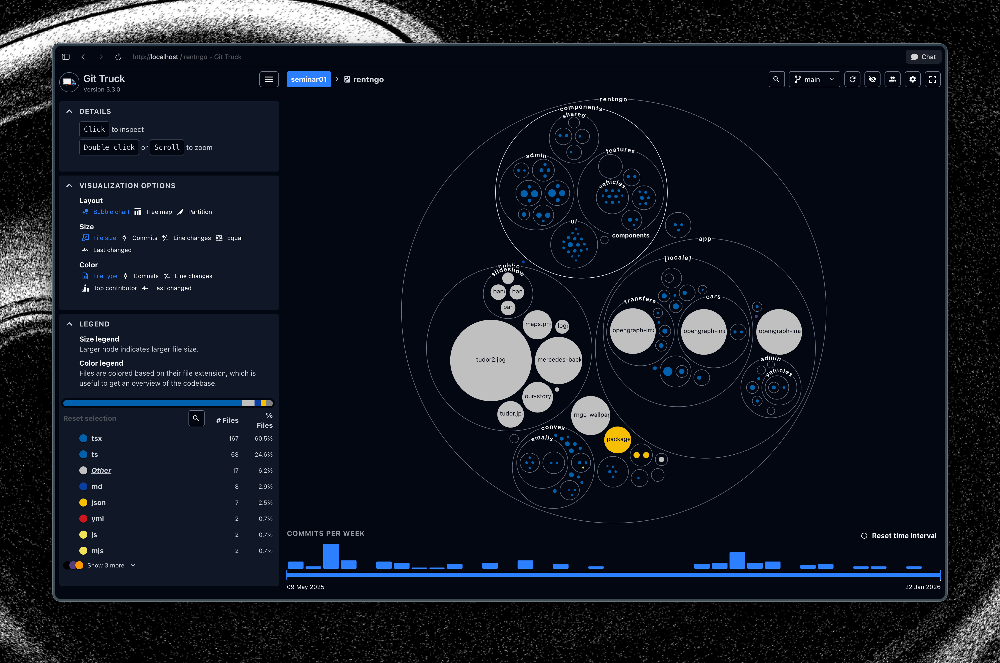
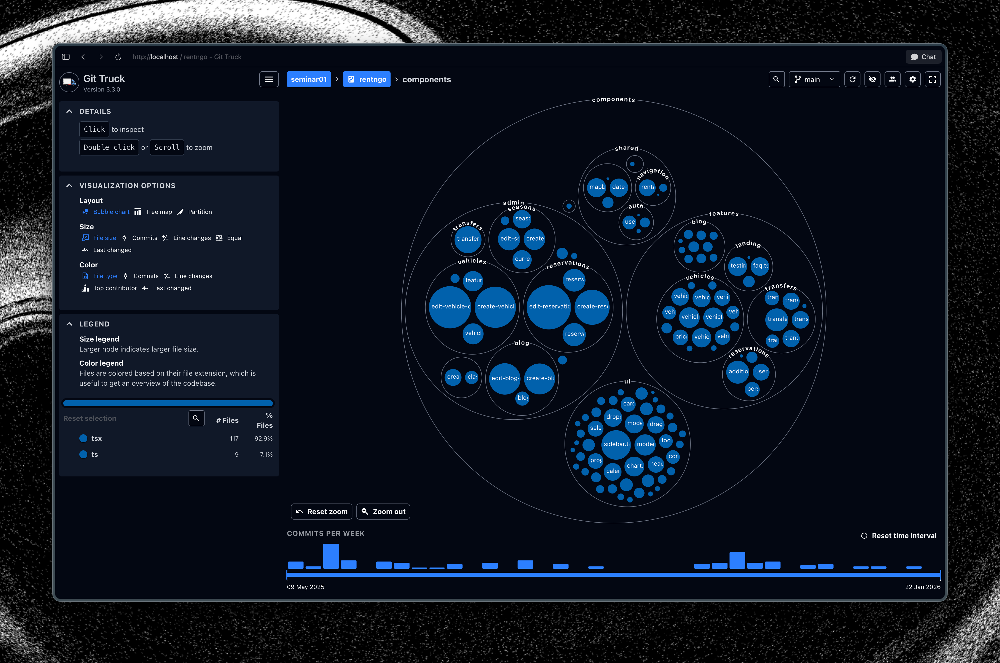
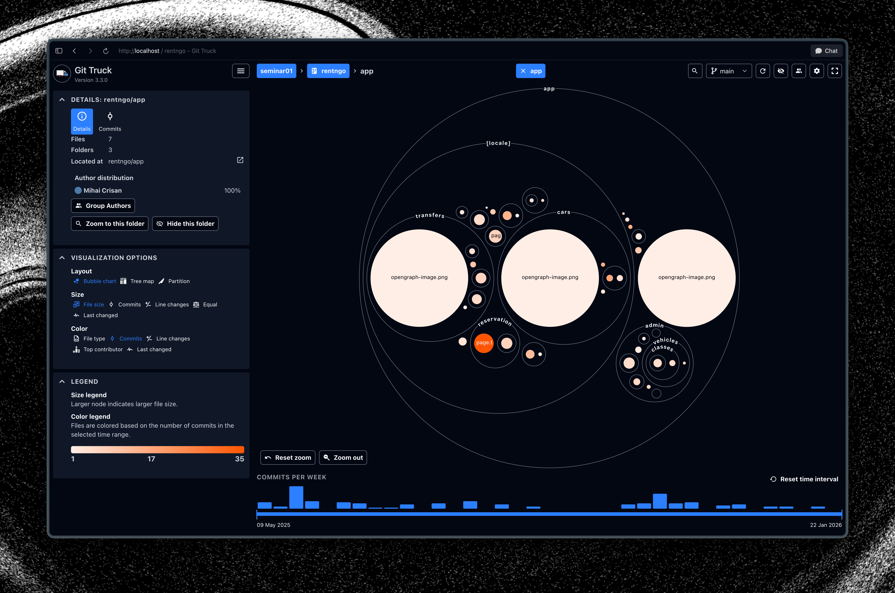
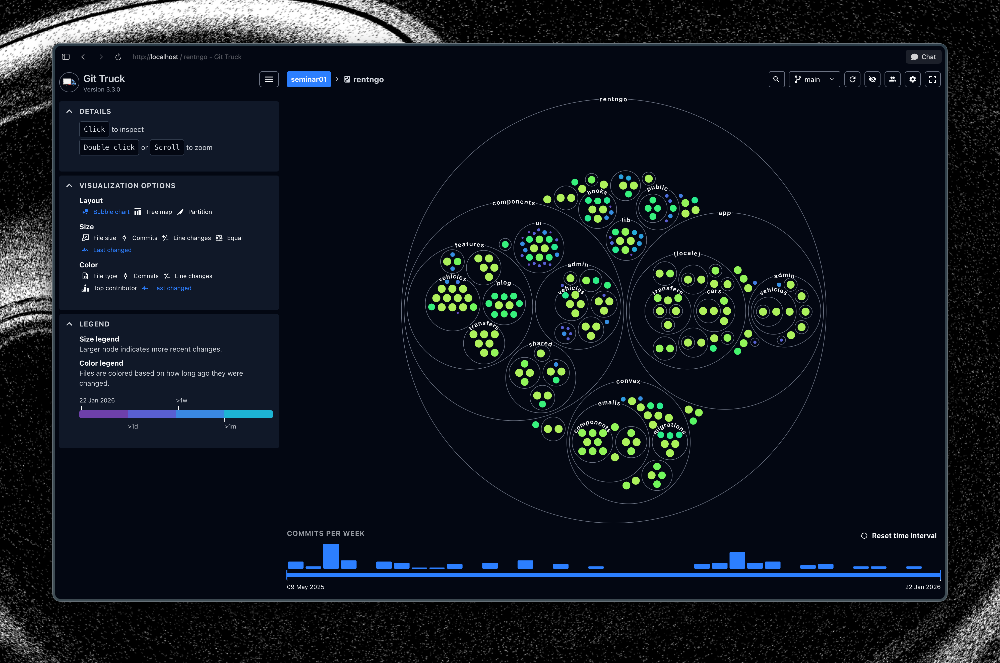

# Tool Analysis: GitTruck@Duck

**Paper:** GitTruck@Duck - Interactive Time Range Selection in Hierarchy-Oriented Polymetric Visualization of Git Repository Evolution\
**DOI:** 10.1109/ICSME58944.2024.00090\
**Conference:** ICSME 2024 - Tool Demo Track\
**Team members:** TODO

## Installation and setup

GitTruck is distributed as an npm package and requires Node.js >= 22 and Git >= 2.29. Installation was straightforward — we used mise (a development environment manager) to install it locally scoped to the project directory via `mise.toml` with `"npm:git-truck" = "3.3.0"`, followed by `mise install`. Alternatively, it can be run without any permanent installation using `npx -y git-truck`. The tool starts a local web server and opens the visualization in the default browser automatically. No configuration files, accounts, or external services are needed — the entire setup from zero to running took under a minute. The only potential friction point is the Node.js 22+ requirement, which may not be available on older systems.

## Usage and benefits

We ran GitTruck on an open-source project (RentNGo, a full-stack web application) to evaluate its capabilities. The tool immediately parsed the repository's Git history and presented an interactive bubble chart visualization. The main benefits we observed:

- **Instant codebase overview**: the bubble chart immediately reveals the project structure, largest files, and folder hierarchy without reading any code. Larger bubbles represent bigger files, and nesting shows the directory structure.
- **Configurable metrics**: switching the color encoding between file type, number of commits, top contributor, and last changed date provides different perspectives on the same codebase. The "last changed" view (Figure 4) is particularly useful for spotting stale vs. actively maintained areas.
- **Time range selection**: the Duck feature — the paper's key contribution — allows narrowing the visualization to a specific time window using the commits-per-week timeline slider (Figure 5). This was useful for isolating activity in specific development phases and understanding how the project evolved.
- **Contributor analysis**: clicking on a folder shows author distribution, making it easy to see who worked on what parts of the codebase (Figure 3).
- **Privacy-first**: everything runs locally, no data leaves the machine.

The tool is most valuable for project leads reviewing team contributions, educators assessing student projects, and developers onboarding onto unfamiliar codebases.

## Screenshots

{ width=85% }

{ width=85% }

{ width=85% }

{ width=85% }

{ width=85% }
